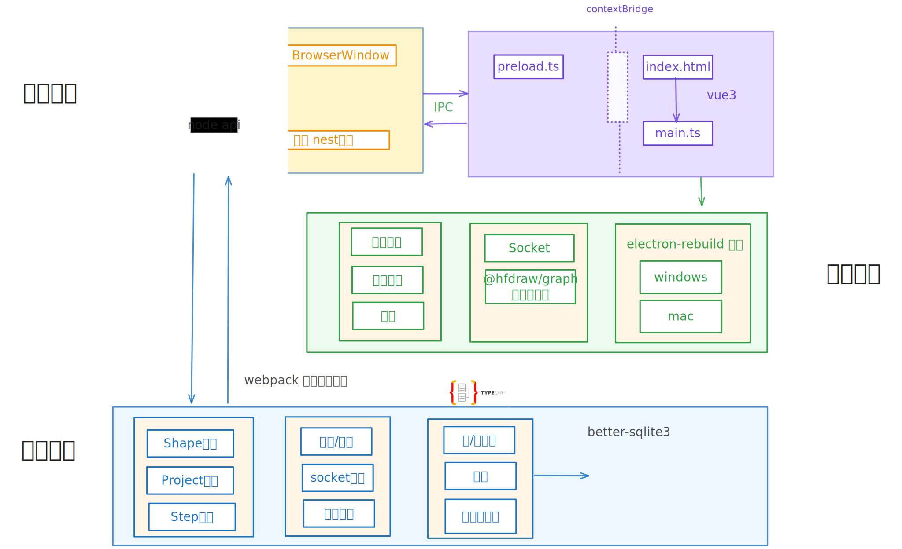
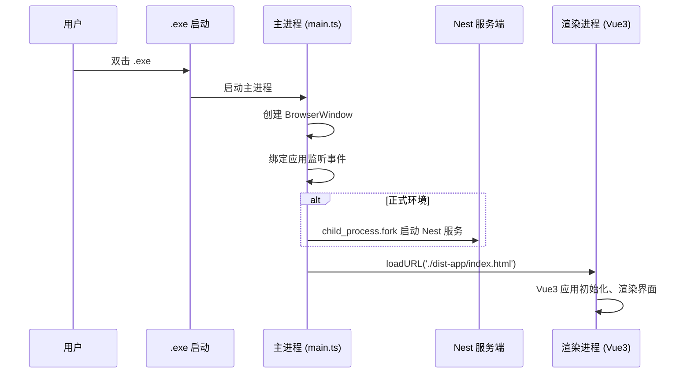

## 前言

## 项目架构



Electron + Vue3 + Nest 应用启动流程说明  
基于架构图，梳理应用通过 `.exe` 启动后的核心流程，用更清晰的分层逻辑呈现：  


### 1. 触发入口：点击 `.exe` 启动  
用户双击应用的 `.exe` 可执行文件，触发 Electron 应用启动流程，**主进程入口 `main.ts` 开始执行**。  


### 2. 主进程初始化（`main.ts` 职责）  
作为 Electron 主进程核心脚本，`main.ts` 承担以下关键任务：  
- **创建 Electron 窗口**：  
  通过 `new BrowserWindow` 实例化主窗口对象，配置窗口属性（如尺寸、标题、是否可resize 等）。  
- **设置应用监听事件**：  
  绑定应用级事件（如 `app.on('ready')` 初始化完成、`app.on('window-all-closed')` 处理窗口关闭逻辑 ），保障应用生命周期管理。  
- **环境判断与服务端启动**：  
  检查运行环境，**若为正式环境**，通过 `child_process.fork` 调用 Node.js 的 `fork` API，启动 Nest 框架打包后的服务端脚本（独立 Node 进程运行后端服务 ）。  


### 3. 加载前端界面：主窗口关联 Vue3 资源  
主进程通过以下代码加载前端静态资源：  
```typescript
mainWindow.loadURL('./dist-app/index.html')
```  
- `./dist-app/index.html` 是 Vue3 项目经 `webpack` 打包后的入口 HTML 文件。  
- 加载后，Electron 渲染进程启动，Vue3 应用初始化，完成界面渲染与交互逻辑挂载。  


### 4. 主进程 ↔ 渲染进程通信  
通过 Electron 的 **IPC（进程间通信）** 机制，主进程与渲染进程（Vue3 前端）实现双向通信：  
- 主进程可主动向渲染进程发送指令（系统事件通知 ）。  
- 渲染进程可调用预加载脚本（`preload.ts` ）中通过 `contextBridge` 暴露的 API，反向触发主进程逻辑（如调用 Nest 服务端接口、操作系统级能力 ）。  

### 5. 前后端协同
* 渲染进程可以通过接口调用访问服务端。
* 服务端当有图形信息变更则通过 socket 消息将信息处理成统一的格式发送给客户端，客户端有一套统一的处理流程进行图形数据处理。

### 6. 完整流程梳理（简化时序）  



## 项目结构
本项目采用 pnpm monorepo 统一管理，前端（apps/draw-client）、后端（services）和通用基础包（packages）协同开发。
* elbow/  

折线路径算法库，提供图形连线的智能路由、路径生成等核心算法，前后端均可复用。

* types/

统一的类型定义（如 Shape、Project、Step 等），确保前后端数据结构一致，提升类型安全和开发效率。
* utils/

通用工具函数库，包含数据处理、数学计算、辅助方法等，供各模块调用。
```
hfdraw/
├── apps/
│   └── draw-client/           # 前端客户端（含 Electron 主进程和 Vue 源码）
│       ├── electron/          # Electron 主进程
│       └── src/               # 前端页面与业务逻辑
├       │── package.json  
│
├── services/                  # 服务端（NestJS 后端）
│   ├── src/
│   │   ├── modules/           # 业务模块（project、shape、step、socket等）
│   │   ├── entities/          # TypeORM 实体
│   │   ├── utils/             # 工具类
│   │   └── ...                # 其他服务端相关代码
├   │── package.json  
│   └── ...                    # 配置、构建、脚本等
│
├── packages/                  # 业务通用包（可被前端/后端复用）
│   ├── elbow/                 # 折线路径算法与工具
│   ├── types/                 # 统一类型定义
│   ├── utils/                 # 通用工具函数
│   └── ...                    # 其他基础包
│
├── doc/                       # 项目文档
│
├── scripts/                   # 部署、构建等脚本
│
├── package.json               # 根依赖管理
└── pnpm-workspace.yaml        # pnpm 多包管理配置
```

monorepo 的好处
* 依赖统一：所有包共享依赖，避免版本冲突，升级维护更简单。
* 代码复用：核心算法、类型、工具等可被前后端直接复用，减少重复开发。
* 协作高效：跨模块改动一处提交，自动联动测试和构建，提升团队协作效率。


## 全栈独立应用开发过程记录
作为一名桌面端开发者，日常工作中也会使用 Nest 框架进行后端开发，因此在年初规划了一款全栈独立应用的开发计划。
整个开发过程因两项主要事务导致进度延缓：
* 家庭方面：孩子出生，需要投入更多时间照顾家庭
* 工作方面：公司业务繁忙，精力被大量占用
经过持续推进，最终在七月初完成了应用的基础版本。
### 开发过程中的核心挑战
开发期间遇到了多个技术难点，主要包括：
* pnpm monorepo 实践中的各类问题
* electron-builder 打包相关的配置与兼容问题
* @hfdraw/elbow 肘线绘制算法的实现与优化
* Nest 框架通过 webpack 打包为单文件的方案探索
* 应用内前进后退机制的设计与实现
* 服务端 Socket 通信及事务处理的统一封装
### 开发感悟
看似功能简单的应用，其开发过程却让我对项目完整流程有了更清晰、更深刻的认识。
如果大家对上述技术细节或开发故事感兴趣，欢迎留言 —— 我会专门整理一期 "踩坑篇"，详细分享其中的解决方案与经验总结。


## 后续计划
* 功能迭代例如: 增加基础图形，支持导出文件、图片，添加缩略图，一键图形对齐等功能。
* 优化交互体验例如：增加应用启动进度提示，增加引导。

如果你有更好的意见欢迎在评论区留言。

## 最后
如果想体验会飞流程图软件的，可以评论区留言，或者私信我，我会发你下载地址。